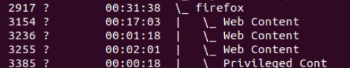

### RAM
#### clean RAM buff/cache

```sh
echo 3 > /proc/sys/vm/drop_caches
```

#### check ram usage for 24 hours w/o monitoring
```sh
 for i in {1..17280}; do echo -e "`date` \n `ps_mem`\n\n" >> /opt/ram_log.txt; sleep 5; done
```

### PS commands

#### Show processes in a hierarchy
```sh
ps -ae --forest
```


####  Show threads
```sh
ps -L PID
```
#### dynamic mode
```sh
watch -n 2 'ps -ef | grep [f]irefox'
```

### Get info abount ssd/hhd
```sh
lshw -class disk
apt install hwinfo -y
hwinfo --disk
```
